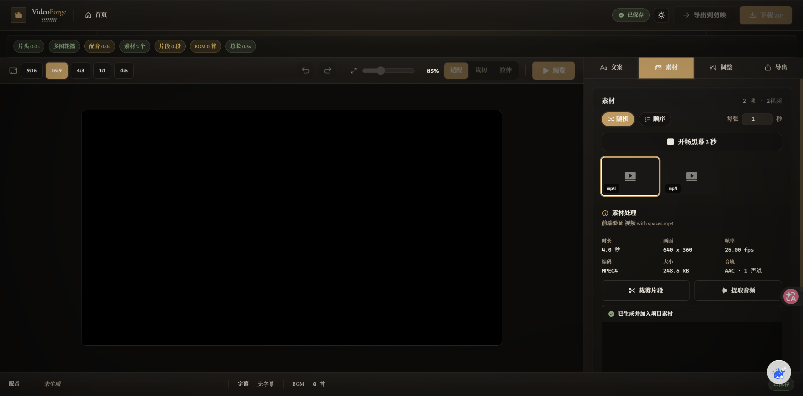
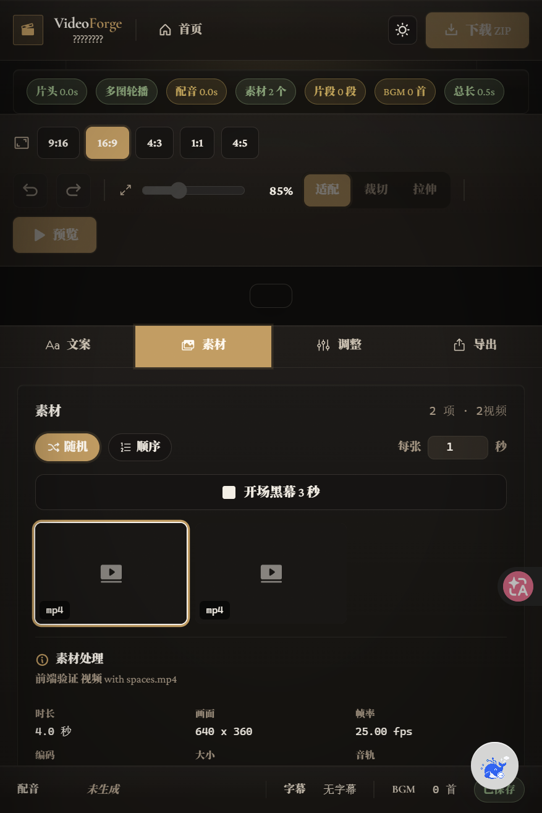

# VideoForge Native Media Provider v0.2

VideoForge now owns the high-frequency local media execution path. `videoforge_native` is the default provider for `media.probe`, `video.trim`, and `audio.extract`; the MediaKit CLI adapter remains optional for compatibility and upstream schema comparison.

The native provider includes:

- Canonical VideoForge capability schemas.
- Local-only path validation and subprocess argument arrays with no shell interpolation.
- FFmpeg and FFprobe dependency discovery.
- Native probe normalization for format, video stream, and audio stream metadata.
- Stream-copy video trimming and MP3 extraction.
- Output existence and media-stream validation.
- Project asset registration with provider, capability, source asset, execution ID, parameters, and ffprobe metadata.

Provider selection is optional in execution requests. Omitting `provider` selects `videoforge_native`; callers may explicitly set `provider: "mediakit"` while the compatibility adapter is installed.

The implementation was informed by MediaKit's registry, local executor, generated plans, dependency admission, and safety boundaries. Attribution is retained in `backend/media_processing/THIRD_PARTY_NOTICES.md`.

## Product placement

Media processing is a contextual project-material capability, not a standalone VideoForge toolbox or primary navigation destination. In a carousel project, selecting a video asset opens a compact **素材处理** inspector in the existing material panel:

- Metadata is probed automatically and shown as duration, dimensions, frame rate, codec, file size, and audio-track facts.
- **裁剪片段** creates a new registered video asset while preserving the source. It does not silently replace the timeline or flatten an edit that should remain explicit.
- **提取音频** creates a registered MP3 derivative and keeps a playable result in the current context.
- Derived assets retain source, capability, parameters, execution record, and FFprobe evidence, then return to the same `Project.assets` collection used by visual planning and scene binding.

This placement keeps VideoForge focused on content structure, timing, visual scenes, asset binding, and editable output. Agent and Factory workflows can later invoke the same canonical capabilities as invisible preprocessing without exposing provider names to ordinary users.

### Browser evidence

Desktop project-material workflow:



Compact-width workflow (`scrollWidth === clientWidth`):



### Frontend verification

```powershell
cd frontend
npm test
npm run build

cd ..\backend
python -m pytest -q
```

The real browser fixture used a four-second MP4 with an audio stream, spaces, and Chinese characters in its filename. Probe, MP3 extraction, and a 0.5-2.5 second trim were triggered from the UI and validated as registered project assets with real files and execution records.
